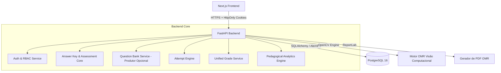

# COLA-ZERO — Arquitetura do Sistema

> **Single Source of Truth** para a arquitetura do sistema, modelo de domínio, modelo de dados e decisões de design.

---

## 1. Visão Geral e Princípios Arquiteturais

COLA-ZERO é uma plataforma educacional de avaliação orientada por:

> **Answer Key + Attempt Engine** *(Gabarito + Motor de Tentativas/Avaliação)*

O **Gabarito (Answer Key)** é o **conceito central de domínio** de todo o sistema. Qualquer avaliação (`Exam`), tentativa digital (`Attempt`) ou leitura física (`OMRScan`) existe e é corrigida em torno de um Gabarito (número do item, resposta correta, peso e mapeamento de habilidades).

O **Banco de Questões (Question Bank)** atua como um **produtor opcional de Gabaritos**. Ele permite gerar Gabaritos estruturados a partir de questões reutilizáveis, mas a plataforma não exige a existência de questões cadastradas para operar.

### Fluxo de Domínio Central
```text
(Question Bank [Produtor Opcional]) ──> Answer Key (Gabarito) ──> Exam ──> Attempt / OMRScan ──> Answer ──> Grade
```

### Pilares Arquiteturais
- **Gabarito como Centro do Domínio**: Todas as correções, notas e relatórios pedagógicos processam estruturas de Gabarito.
- **Question Bank como Produtor Opcional**: O repositório de questões gera Gabaritos vinculados a enunciados e alternativas, mas o Gabarito pode ser cadastrado diretamente sem questões.
- **Entrega Sequencial (Uma questão por vez)**: Exames online com questões entregam uma questão por vez com autosave.
- **Persistência Imediata (Autosave)**: Respostas digitais são salvas imediatamente após submissão contra o Gabarito.
- **Entidade Unificada de Nota (`Grade`)**: Consolidação de notas acadêmicas independentemente da origem (Online ou OMR).
- **Segurança por Padrão**: Identidade fortificada por cookies HttpOnly (`SameSite=Lax/Strict`), RBAC em todas as rotas e auditoria de ações sensíveis.

---

## 2. Visão de Componentes e Interações



### 2.1 Frontend (`frontend/`)
- **Tecnologias**: Next.js 16 (App Router), React 19, TypeScript 5, TailwindCSS 4.
- **Responsabilidades**:
  - Autenticação e gestão de sessão via cookies HttpOnly.
  - Dashboards por perfil (`STUDENT`, `TEACHER`, `ADMIN`).
  - Execução de tentativas online (renderizando 1 questão por vez quando vinculada ao Question Bank).
  - Base para captura de eventos de segurança de tela (`visibilitychange`, `blur`, `focus`, `fullscreen`) quando a instrumentação do fluxo online está habilitada.
  - Interface de OMR (criação de gabarito, download de PDF, upload de foto e revisão visual).
  - Visualização de estatísticas pedagógicas e desempenho por habilidade (SEDU/BNCC) alimentados pelo Gabarito.

### 2.2 Backend (`backend/`)
- **Tecnologias**: Python 3.12, FastAPI 0.137, SQLAlchemy 2.0, Alembic 1.18, Pydantic 2.13, OpenCV, ReportLab.
- **Responsabilidades**:
  - Autenticação JWT e autorização RBAC decorada (`@require_role`).
  - Gestão e resolução de Gabaritos (`AnswerKey`) para exames online e impressos.
  - Gestão do Banco de Questões como produtor de Gabaritos (com imutabilidade e versionamento).
  - Composição e publicação de exames (online e impressos).
  - Motor de tentativas online e autosave de respostas contra o Gabarito.
  - Motor OMR de leitura óptica de cartões-resposta impressos contra o Gabarito.
  - Processamento de estatísticas pedagógicas unificadas (operando diretamente sobre o Gabarito e Habilidades).
  - Auditoria de segurança e governança LGPD.

### 2.3 Banco de Dados (`PostgreSQL 16`)
- Banco relacional com chaves primárias **UUID v4** e foco na rastreabilidade acadêmica imutável.

---

## 3. Modelo de Domínio

### 3.1 O Gabarito (`Answer Key`) — Conceito Central
O Gabarito é o contrato operacional da avaliação. Ele define:
- Coleção de itens numerados ($1 \dots N$).
- Resposta esperada / gabarito oficial de cada item.
- Peso acadêmico de cada item.
- Associação com Habilidades Pedagogicas (`skills` BNCC/SEDU).
- Conteúdo visual de questão (opcional, fornecido quando produzido pelo Question Bank).

### 3.2 O Banco de Questões (`Question Bank`) — Produtor Opcional
- O Question Bank é um repositório reutilizável que **produz Gabaritos enriquecidos**.
- Quando um exame é montado via Question Bank, o sistema gera o Gabarito e anexa as referências das questões (`exam_questions` -> `questions`).
- **Imutabilidade e Versionamento**: Questões publicadas no Question Bank são imutáveis (`parent_id`, `version`, `is_active`).

### 3.3 Habilidades Pedagógicas (`Skills`)
- Habilidades BNCC/SEDU são vinculadas diretamente aos itens do Gabarito (seja via `question_skills` no Question Bank ou via `exam_item_skills` no Gabarito direto).

### 3.4 Avaliações e Provas (`Exams`)
- Uma avaliação (`Exam`) estrutura a execução de um Gabarito para uma turma (`class_id`), definindo status (`draft`, `published`, `archived`), tempo limite, máximo de tentativas e randomização.

### 3.5 Motor de Tentativas e OMR (`Attempt Engine` / `OMR Engine`)
- Avaliações digitais (`attempts` & `attempt_answers`) e cartões impressos (`omr_scans`) submetem respostas que são validadas contra o Gabarito do exame.

### 3.6 Entidade Unificada de Nota (`Grade`)
- Os acertos validados contra o Gabarito geram notas consolidadas registradas na tabela `grades` (`source_type = 'ONLINE'` ou `'OMR'`).

---

## 4. Modelo de Banco de Dados Atual

O schema relacional atual mantém o COLA-ZERO centrado em `AnswerKey` e em vínculos explícitos de acesso e atribuição. As tabelas principais já presentes são:

| Grupo | Tabelas | Responsabilidade |
|-------|---------|------------------|
| Identidade | `users` | usuários, credenciais, perfis e `student_code` |
| Banco de Questões | `questions`, `question_skills`, `skills` | reuso de questões, versionamento e vínculo com habilidades |
| Turmas e acesso | `classes`, `teacher_classes`, `class_students` | turma concreta, vínculo professor↔turma, matrícula histórica do aluno |
| Avaliações | `exams`, `exam_classes`, `exam_questions` | configuração da prova, atribuição multi-turma e composição via Question Bank |
| Gabarito | `answer_keys`, `answer_key_items`, `answer_key_item_skills` | fonte canônica de correção e snapshot de habilidades |
| Tentativas | `attempts`, `attempt_answers` | execução online e persistência das respostas |
| OMR | `omr_templates`, `omr_scans` | layout e processamento das folhas de resposta sem armazenar resposta correta no template |
| Notas | `grades` | nota unificada para origem `ONLINE` e `OMR` |
| Governança | `security_events`, `audit_logs`, `consents` | monitoramento, trilha de auditoria e consentimentos LGPD |

### 4.1 Regras de relacionamento já consolidadas

- `Class` representa uma turma concreta de um período acadêmico.
- `Class.teacher_id` permanece como metadado de proveniência/criação; a autorização de professor usa `teacher_classes`.
- `class_students` preserva histórico de matrícula e permite no máximo uma matrícula ativa por estudante e período.
- `Exam.class_id` continua como campo legado de compatibilidade e não é a fonte primária de atribuição; `exam_classes` é o vínculo canônico entre exame e turma.
- `ExamQuestion` projeta `Question` em `AnswerKeyItem` durante Workflow A.
- `AnswerKeyItem.correct_answer` é a única resposta canônica para correção.
- `AnswerKeyItem.question_id` é `NULL` em Workflow B e preenchido em Workflow A.
- `OMRTemplate.correct_answers` foi removido do modelo e do schema.
- `Attempt` e `AttemptAnswer` carregam referências para `AnswerKey`/`AnswerKeyItem` e preservam a proveniência da tentativa.
- `AuditLog` é imutável por política de aplicação e `SecurityEvent` está vinculado à tentativa online correspondente.

### 4.2 Índices e constraints relevantes

- `users.email` é único e `student_code` possui índice único parcial quando presente.
- `class_students` possui constraint para impedir duplicidade ativa por estudante/período.
- `teacher_classes` e `exam_classes` usam chaves únicas compostas para evitar duplicação de vínculo.
- `answer_key_items` possui constraint para manter `item_number` determinístico por `answer_key_id`.
- `attempt_answers` preserva `question_id` apenas como proveniência e usa `answer_key_item_id` como referência de correção.
- `consents` mantém histórico de concessão e revogação por propósito/política.

---

## 5. Decisões de Design (Design Decisions)

### DECISION-001: Hashing de Senhas e Cookies HttpOnly
- Access Token em cookie HttpOnly (`SameSite=Lax`), Refresh Token em cookie HttpOnly (`SameSite=Strict`), senhas em `bcrypt`.

### DECISION-002: O Gabarito (`Answer Key`) como Entidade Central de Domínio
- **Contexto**: Modelar o sistema tendo o Banco de Questões como núcleo impediria o suporte a provas externas, gabaritos diretos e correções OMR avulsas.
- **Decisão**: O Gabarito (`Answer Key`) é a entidade central do domínio. O Banco de Questões é um produtor opcional de Gabaritos. Toda avaliação, correção, tentativa e relatório opera sobre o Gabarito.

### DECISION-003: Versionamento Imutável no Produtor de Gabaritos (Question Bank)
- **Contexto**: Modificações em questões reutilizadas poderiam alterar retrospectivamente Gabaritos de provas já aplicadas.
- **Decisão**: Questões no Question Bank são imutáveis. Edições geram novas linhas (`version + 1`, `parent_id = original_id`) e preservam os Gabaritos históricos travados no UUID específico da versão.

### DECISION-004: Layout Registry OMR em Código
- Coordenadas geométricas dos cartões OMR são mantidas em código (`app/core/omr_layouts.py`). O banco salva apenas a versão (`layout_version`).

### DECISION-005: Entidade Unificada de Nota (`Grade`)
- Todas as validações efetuadas contra Gabaritos (online ou OMR) gravam a pontuação final na tabela compartilhada `grades`.

---

## 6. Documentos de Planejamento Específicos

- [PLANO_AVALIACOES.md](PLANO_AVALIACOES.md) — Especificação funcional baseada em Gabarito.
- [PLANO_BANCO_QUESTOES.md](PLANO_BANCO_QUESTOES.md) — Especificação do produtor opcional de Gabaritos.
- [PLANO_OMR.md](PLANO_OMR.md) — Leitura óptica de cartões-resposta validados contra o Gabarito.
- [PLANO_DASHBOARD.md](PLANO_DASHBOARD.md) — Analytics pedagógico operando diretamente sobre o Gabarito e Habilidades.
- [PLANO_ANTI_COLA.md](PLANO_ANTI_COLA.md) — Monitoramento de integridade online e conformidade LGPD.
