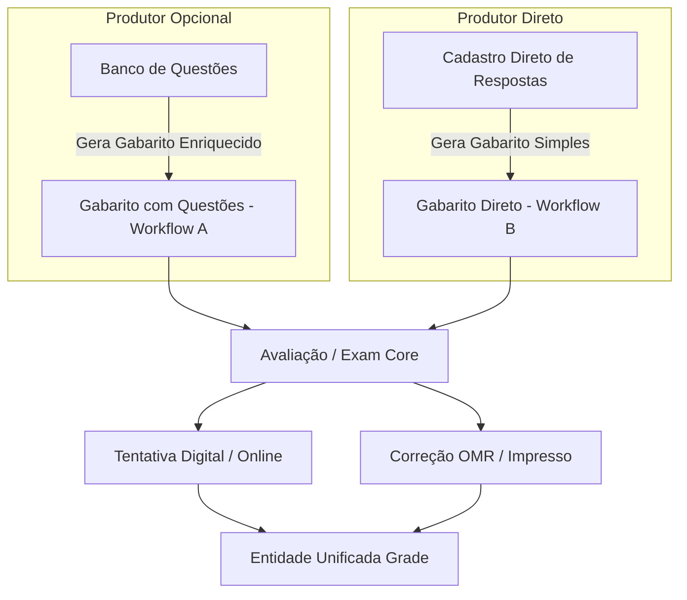

# COLA-ZERO — Especificação Funcional do Sistema de Avaliações (`PLANO_AVALIACOES.md`)

> **Single Source of Truth** para a especificação funcional do sistema de avaliações, ciclo de vida das provas, modelo centrado no **Gabarito (Answer Key)**, motor de tentativas e consolidação de notas.

---

## 1. O Gabarito (`Answer Key`) como Conceito Central de Domínio

No COLA-ZERO, o **Gabarito (Answer Key)** é o conceito central de todo o domínio avaliativo.

Uma Avaliação (`Exam`) é fundamentalmente a especificação e execução de um **Gabarito**. Qualquer correção, cálculo de nota, tentativa digital (`Attempt`) ou leitura física (`OMRScan`) ocorre pela validação das respostas dos alunos contra a estrutura do Gabarito.

### Estrutura do Gabarito
Cada Gabarito define:
- Quantidade total de itens ($1 \dots N$).
- Resposta oficial esperada para cada item (ex: Item 1 = "A", Item 2 = "C").
- Peso acadêmico por item.
- Mapeamento opcional de Habilidades Pedagógicas (SEDU/BNCC).
- Conteúdo de questão visual associado (opcional, fornecido quando o Gabarito é gerado via Question Bank).

---

## 2. Produção de Gabaritos e Fluxos de Trabalho

A plataforma suporta duas formas de produção de Gabaritos:

### 2.1 Workflow A — Gabarito Gerado pelo Banco de Questões
- **Origem**: O Gabarito é produzido a partir de questões selecionadas no Question Bank.
- **Funcionamento**: O sistema compõe `AnswerKey` e `AnswerKeyItem` a partir das questões (`exam_questions` -> `questions`), copiando enunciado, resposta correta, peso e habilidades como snapshot de publicação.

### 2.2 Workflow B — Gabarito Direto (Sem Banco de Questões)
- **Origem**: O Gabarito é cadastrado diretamente pelo professor, sem utilizar o Banco de Questões.
- **Funcionamento**: O professor informa a chave de respostas por item e atribui opcionalmente as habilidades pedagógicas em `exam_item_skills`. Não há nenhuma questão cadastrada no banco.
- **Execução**: O motor de tentativas, a correção OMR e o dashboard pedagógico funcionam **com 100% de paridade**, pois operam diretamente sobre `AnswerKeyItem`.

---

## 3. Ciclo de Vida da Avaliação (`Exam`)

### Regras de Publicação do Gabarito (`POST /exams/{id}/publish`)
Um exame só transiciona do status `draft` para `published` se:
1. Possuir um **título** preenchido.
2. Possuir um `AnswerKey` válido, seja gerado por Workflow A ou cadastrado diretamente por Workflow B.
3. Possuir ao menos um item de gabarito.
4. O usuário requisitante tiver permissão sobre a avaliação.
5. O fluxo de publicação não exponha o gabarito ao estudante.

---

## 4. Execução de Avaliações Online e Motor de Tentativas (`Attempt Engine`)

### 4.1 Validação de Respostas contra o Gabarito
- Durante a tentativa online, o estudante submete respostas (`attempt_answers`) para os itens do Gabarito.
- **Entrega Sequencial**: quando a avaliação possui conteúdo vindo do Question Bank, o backend fornece apenas a questão atual (`GET /attempts/{id}/next-question`).
- **Autosave**: cada resposta submetida (`POST /attempts/{id}/answers`) é validada e gravada imediatamente no banco de dados.

### 4.2 Regras de Tentativas (`Attempt`)
- Controle por `exams.max_attempts` (default = 1).
- Permitida apenas uma tentativa ativa (`in_progress`) por aluno.
- Tentativas submetidas (`submitted`) ou corrigidas (`graded`) são imutáveis.

---

## 5. Avaliações Impressas e OMR
- As folhas de resposta OMR são impressas e lidas contra o Gabarito da avaliação.
- Consulte [PLANO_OMR.md](file:///var/home/nmoreira/Projetos/cola-zero/PLANO_OMR.md) para detalhes do pipeline visual OpenCV.

---

## 6. Consolidação de Notas (`Grade`)
- Respostas validadas contra o Gabarito (online ou OMR) calculam o score final e inserem o registro na tabela unificada `grades` (`source_type = 'ONLINE'` ou `'OMR'`).

---

## 7. Relação com o Dashboard Pedagógico
- Como a inteligência pedagógica é calculada a partir do Gabarito e Habilidades, a análise de acertos e relatórios funcionam com total transparência e uniformidade para qualquer avaliação. Consulte [PLANO_DASHBOARD.md](file:///var/home/nmoreira/Projetos/cola-zero/PLANO_DASHBOARD.md).

## 8. Próxima Evolução Planejada
- A etapa operacional de montagem visual da prova e geração de folhas OMR personalizadas por aluno está detalhada em [PLANO_PRODUCAO_PROVAS.md](file:///var/home/nmoreira/Projetos/cola-zero/PLANO_PRODUCAO_PROVAS.md).
