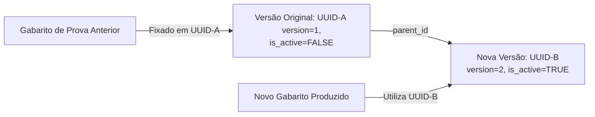

# COLA-ZERO — Planejamento do Banco de Questões (`PLANO_BANCO_QUESTOES.md`)

> **Single Source of Truth** para o Banco de Questões como **produtor opcional de Gabaritos**, repositório de conteúdo reutilizável, versionamento imutável e associação de habilidades SEDU/BNCC.

---

## 1. O Banco de Questões como Produtor Opcional de Gabaritos

> [!IMPORTANT]
> **CONCEITO CENTRAL DE DOMÍNIO**: O modelo de avaliação do COLA-ZERO é centrado no **Gabarito (Answer Key)**.
> 
> O **Banco de Questões (Question Bank)** é um **PRODUTOR OPCIONAL DE GABARITOS**. Sua função é enriquecer a criação de avaliações permitindo gerar Gabaritos estruturados a partir de acervos de questões reutilizáveis, com enunciados, opções visuais e justificativas. No entanto, o Banco de Questões **NÃO É O NÚCLEO** do modelo avaliativo e sua utilização não é obrigatória para a aplicação de exames ou relatórios.

---

## 2. Funcionamento do Produtor de Gabaritos

Quando um professor opta por montar uma avaliação utilizando o Banco de Questões:
1. O professor seleciona questões cadastradas do acervo.
2. O sistema compõe o **Gabarito** da prova (`Exam`), projetando as questões selecionadas (`exam_questions` -> `questions`) para `AnswerKey` e `AnswerKeyItem`.
3. O sistema anexa o conteúdo visual da questão (enunciado, alternativas em JSONB, imagens) ao Gabarito para renderização na entrega digital online e para a captura de contexto pedagógico.

### Habilidades Pedagógicas (BNCC / SEDU)
- Habilidades (`skills`) podem ser vinculadas às questões no banco (`question_skills`).
- Ao produzir um Gabarito, as habilidades das questões são herdadas automaticamente pelos itens do Gabarito como snapshot de publicação.
- **Independência de Habilidades**: habilidades existem como entidades autônomas no sistema e podem ser associadas a itens de Gabaritos diretos mesmo que nenhuma questão exista no Question Bank.

---

## 3. Versionamento Imutável no Produtor de Questões

Para garantir que a edição de uma questão reutilizável no Banco de Questões não altere nem invalide Gabaritos históricos de avaliações aplicadas no passado, o Question Bank utiliza o padrão de **Imutabilidade por Versionamento**. O backend já materializa o snapshot de publicação em `AnswerKeyItem`.

### Regras de Versionamento
1. **Questão Inicial**: Criada com `id UUID`, `parent_id = NULL`, `version = 1` e `is_active = TRUE`.
2. **Edição de Questão Utilizada**:
   - O registro original (`UUID-A`) permanece inalterado para preservar Gabaritos históricos.
   - Um novo registro é inserido (`UUID-B`), com `parent_id` apontando para `UUID-A`, `version = version + 1` e `is_active = TRUE`.
   - A versão anterior tem `is_active` alterado para `FALSE`.
3. **Produção de Novos Gabaritos**: Novos exames sempre selecionam a versão ativa (`is_active = TRUE`).
4. **Gabaritos Históricos**: Exames passados mantêm o vínculo ao `id UUID` exato da versão utilizada na época de sua publicação.

---

## 4. Regras de Exclusão e Soft Delete

- Questões vinculadas a Gabaritos publicados não podem sofrer exclusão física do banco (`ON DELETE RESTRICT`).
- A exclusão lógica é feita definindo `is_active = FALSE`, impedindo que a questão seja usada em futuros Gabaritos sem apagar o histórico acadêmico.

---

## 5. Endpoints de API do Banco de Questões

- `POST /api/v1/questions`: Cadastra nova questão no repositório.
- `GET /api/v1/questions`: Consulta questões com filtros (disciplina, dificuldade, tags, habilidade).
- `GET /api/v1/questions/{id}`: Consulta versão específica de uma questão.
- `PATCH /api/v1/questions/{id}`: Edita questão (gera nova versão mantendo histórico).
- `DELETE /api/v1/questions/{id}`: Marca questão como inativa (`is_active = FALSE`).

---

## 6. Estado Atual

- O modelo já é reutilizável no backend atual.
- O gabarito publicado é a fonte canônica de correção.
- Alterações posteriores em `Question` não alteram gabaritos publicados.
