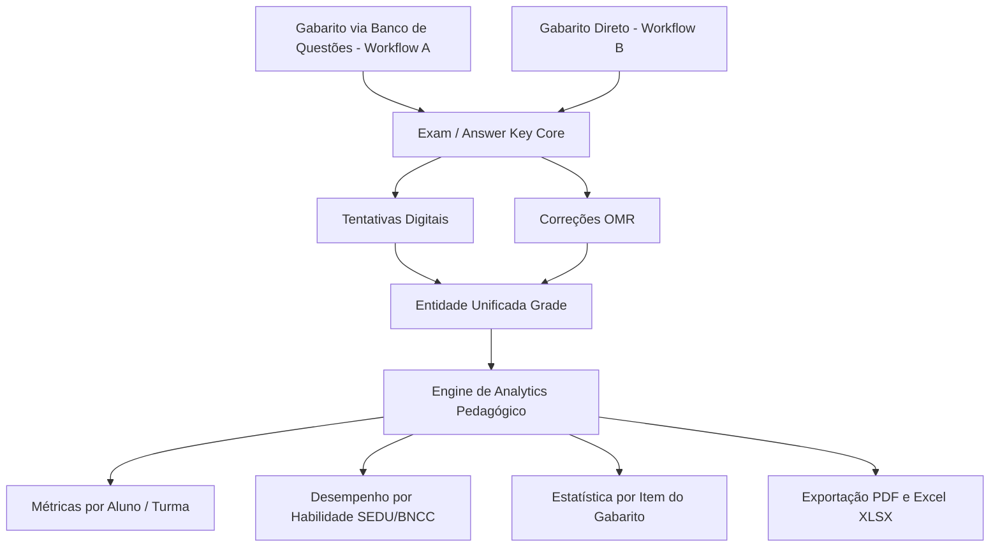

# COLA-ZERO — Planejamento do Dashboard Pedagógico (`PLANO_DASHBOARD.md`)

> **Single Source of Truth** para a arquitetura de analytics pedagógico, relatórios de desempenho por habilidade (SEDU/BNCC), estatísticas de avaliação e exportações de dados operando sobre o **Gabarito (Answer Key)**.

---

## 1. O Gabarito como Base do Analytics Pedagógico

> [!IMPORTANT]
> **PRINCÍPIO DE DOMÍNIO**: O Dashboard Pedagógico opera diretamente sobre o **Gabarito (Answer Key)**.
> 
> Como o Gabarito é o conceito central de todo o sistema COLA-ZERO, o motor de analytics avalia o desempenho dos alunos processando as respostas contra a estrutura de Gabarito do exame, **independente de como esse Gabarito foi produzido** (se gerado via Banco de Questões no Workflow A ou cadastrado diretamente no Workflow B).

---

## 2. Visão Geral do Analytics

O motor de analytics calcula métricas pedagógicas combinando os dados da tabela unificada de notas (`grades`), das respostas individuais por item (`attempt_answers` / `omr_scans`) e dos vínculos de Habilidades no Gabarito.

---

## 3. Uniformidade no Processamento por Habilidade

Como todas as avaliações no COLA-ZERO possuem um Gabarito subjacente:
- **Gabarito Produzido por Questões (Workflow A)**: O item $N$ do Gabarito está associado às habilidades da questão correspondente (`question_skills`).
- **Gabarito Direto sem Questões (Workflow B)**: O item $N$ do Gabarito está associado às habilidades configuradas em `exam_item_skills`.

Em ambos os casos, o motor de analytics processa exatamente a mesma estrutura: `Item N -> Resposta Correta -> Habilidade`. O resultado final (gráficos de acertos por habilidade, médias e relatórios) é **100% idêntico**.

---

## 4. Métricas e Relatórios Suportados

### 4.1 Desempenho Geral por Turma e Avaliação
- Média da turma, nota máxima, nota mínima e desvio padrão.
- Distribuição percentual de alunos por faixas de rendimento.

### 4.2 Analytics por Habilidade (SEDU / BNCC)
- Taxa de domínio (%) dos alunos por código de habilidade (ex: `EF07MA01`).
- Mapeamento de habilidades críticas (abaixo do limiar pedagógico esperado).

### 4.3 Estatística por Item de Gabarito
- Índice de acerto por item do Gabarito.
- Análise de distratores: percentual de seleção de alternativas por item (A, B, C, D, E).

---

## 5. Exportações Nativas

- **Relatório Executivo em PDF** (`GET /api/v1/exams/{id}/export/pdf`): Documento em PDF (ReportLab) com análise do Gabarito e desempenho por habilidade.
- **Planilha em Excel XLSX** (`GET /api/v1/exams/{id}/export/xlsx`): Matriz completa de notas, itens do Gabarito e mapa de habilidades.

---

## 6. Estado Atual

- O backend e o frontend já expõem a base do dashboard pedagógico.
- O pipeline atual já consome `AnswerKey`, `AnswerKeyItem`, `grades` e `skills`.
- Evoluções de analytics avançado e camadas visuais mais ricas permanecem como próximos incrementos.
