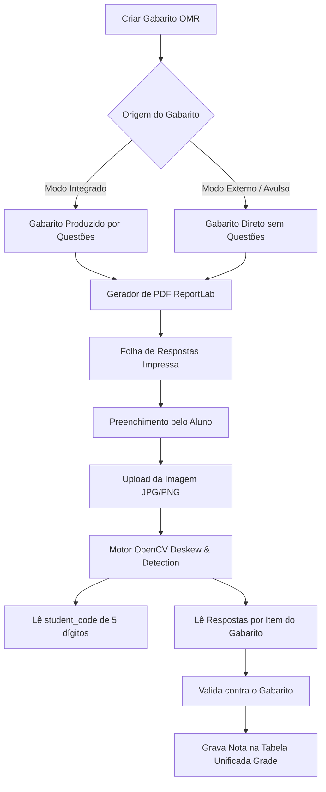

# COLA-ZERO — Especificação e Planejamento OMR (Gabaritos Impressos)

> **Single Source of Truth** para o fluxo de provas impressas, correção de cartões-resposta validados contra o **Gabarito (Answer Key)**, pipeline OpenCV e geração de folhas de respostas em PDF.

> [!IMPORTANT]
> **REGRA FUNDAMENTAL**: O Módulo OMR é utilizado **EXCLUSIVAMENTE para provas impressas (físicas)**. Avaliações online NUNCA utilizam OMR.
> O OMR é uma ferramenta de correção automatizada e **NÃO FAZ PARTE de mecanismos anti-cola ou de monitoramento de integridade**.

---

## 1. Visão Geral e Correção contra o Gabarito

O módulo OMR (Optical Mark Recognition) valida o preenchimento de folhas de respostas físicas comparando os marcadores lidos pela visão computacional contra o **Gabarito (Answer Key)** oficial da avaliação.

> A geração de folhas OMR personalizadas por aluno e a visualização prévia da prova montada são planejadas separadamente em [PLANO_PRODUCAO_PROVAS.md](PLANO_PRODUCAO_PROVAS.md).

### 1.1 Modo Integrado (Gabarito Produzido pelo Question Bank)
- **Vínculo**: O Gabarito da prova impressa foi gerado a partir de questões reutilizáveis (`omr_templates.exam_id` -> `exams`).
- **Correção**: As respostas lidas no cartão são validadas contra o Gabarito das questões vinculadas.

### 1.2 Modo Externo / Avulso (Gabarito Direto)
- **Vínculo**: O Gabarito é informado diretamente no template (`correct_answers = {"1": "A", "2": "C"}`).
- **Correção**: Não exige nenhuma questão no banco de dados. As respostas lidas são validadas diretamente contra a chave cadastrada.

---

## 2. Identificação do Estudante: Grid Numérico de 5 Dígitos

- A folha de respostas em PDF gerada pelo ReportLab possui um grid numérico OMR de 5 dígitos (00000 a 99999).
- O PDF é impresso com as bolhas do `student_code` do aluno **pré-sombreadas** em preto sólido, evitando erros de preenchimento.

---

## 3. Pipeline da Visão Computacional OpenCV

1. **Image Loader**: Carrega o arquivo de imagem (JPG/PNG).
2. **Deskew & Perspective Warp**: Localiza as 4 âncoras dos cantos e aplica homografia para alinhar a imagem.
3. **Calibração Adaptativa**: Calcula os limiares dinâmicos de pixel preto/branco.
4. **Leitura do `student_code`**: Identifica os 5 dígitos do aluno no grid de identificação.
5. **Leitura dos Itens do Gabarito**: Extrai a opção selecionada (A, B, C, D, E) para cada item do Gabarito.
6. **Validação e Confiabilidade**: Se houver marcações duplas ou rasuras, o status é alterado para `review_needed` para revisão do professor.
7. **Gravação**: Persiste os dados em `omr_scans` e insere a nota final consolidada em `grades`.
