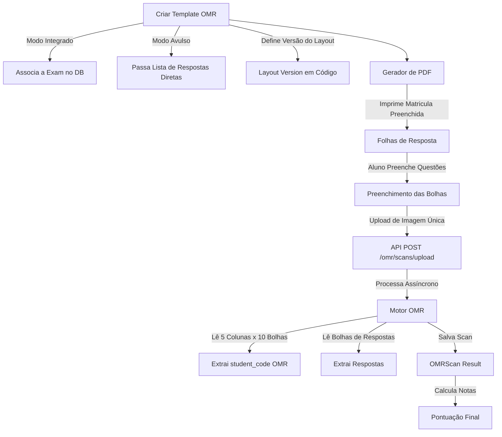

# COLA-ZERO — Planejamento Simplificado de Gabaritos e Correção OMR (MVP)

Este documento detalha o planejamento arquitetural revisado para a funcionalidade de geração de gabaritos impressos e correção automática por imagem (**OMR — Optical Mark Recognition**).

O foco desta revisão é **priorizar a simplicidade operacional do MVP**, removendo dependências complexas (como QR Codes e quebra de PDFs multipágina), desacoplando o OMR do fluxo principal de provas (`Exam`), e mantendo a configuração geométrica de coordenadas direto no código.

---

## 1. Visão Geral da Arquitetura (Modo Duplo)

O módulo OMR funcionará de forma independente do core de tentativas online. Ele suportará dois modos de operação:

1. **Modo Integrado:** O gabarito é associado a um exame cadastrado (`Exam`) no banco de dados, utilizando as questões, gabaritos e pesos oficiais do sistema para cálculo de notas.
2. **Modo Avulso (Standalone):** O gabarito é criado de forma isolada, definindo apenas o número de questões e a chave de respostas corretas diretamente no payload (ex: Q1=A, Q2=C). Útil para correções rápidas de provas externas.



---

## 2. Modelagem de Banco de Dados

Substituímos o campo de configuração dinâmica `layout_config` por uma string que referencia a versão do layout controlada no código. O vínculo com `exam_id` tornou-se opcional (`NULL`).

### 2.1 `omr_templates`
```sql
CREATE TABLE omr_templates (
    id UUID PRIMARY KEY,
    exam_id UUID NULL REFERENCES exams(id) ON DELETE SET NULL, -- Opcional (Modo Integrado)
    layout_version VARCHAR(50) NOT NULL, -- Ex: 'v1_std_20q', 'v1_std_50q'
    total_questions INTEGER NOT NULL,
    options_per_question INTEGER NOT NULL DEFAULT 5, -- A, B, C, D, E
    correct_answers JSONB NULL, -- Obrigatório apenas em Modo Avulso. Ex: {"1": "A", "2": "C"}
    created_at TIMESTAMP NOT NULL DEFAULT NOW(),
    updated_at TIMESTAMP NOT NULL DEFAULT NOW()
);
```

### 2.2 `omr_scans`
Armazena a folha processada, contendo a matrícula de 5 dígitos lida via OMR.

```sql
CREATE TYPE omr_scan_status AS ENUM ('processing', 'success', 'review_needed', 'failed');

CREATE TABLE omr_scans (
    id UUID PRIMARY KEY,
    omr_template_id UUID NOT NULL REFERENCES omr_templates(id) ON DELETE CASCADE,
    student_code VARCHAR(5) NULL, -- Código de 5 dígitos detectado no grid OMR
    student_id UUID NULL REFERENCES users(id) ON DELETE SET NULL, -- Identificado via student_code
    status OMR_SCAN_STATUS NOT NULL DEFAULT 'processing',
    image_url TEXT NOT NULL, -- Caminho do arquivo de imagem enviado
    detected_answers JSONB, -- Ex: {"1": "A", "2": "C"}
    raw_confidence JSONB,
    score NUMERIC(5,2), -- Pontuação lida/computada
    error_message TEXT,
    processed_at TIMESTAMP,
    created_at TIMESTAMP NOT NULL DEFAULT NOW(),
    updated_at TIMESTAMP NOT NULL DEFAULT NOW()
);
```

### 2.3 `grades` (Tabela Unificada de Notas)
Tabela unificada de notas compartilhada por todas as fontes de avaliação do sistema.

```sql
CREATE TABLE grades (
    id UUID PRIMARY KEY,
    student_id UUID NOT NULL REFERENCES users(id) ON DELETE RESTRICT,
    source_type VARCHAR(50) NOT NULL, -- 'ONLINE', 'OMR'
    source_id UUID NOT NULL, -- attempts.id ou omr_scans.id
    score NUMERIC(5,2) NOT NULL,
    teacher_id UUID NOT NULL REFERENCES users(id) ON DELETE RESTRICT,
    created_at TIMESTAMP NOT NULL DEFAULT NOW(),
    updated_at TIMESTAMP NOT NULL DEFAULT NOW()
);
```

---

## 3. Identificação do Aluno: Grid Numérico de 5 Dígitos OMR

Para simplificar a operação de triagem e remover bibliotecas de leitura de QR Code, a folha de respostas conterá um **Grid Numérico OMR de 5 dígitos** (`student_code` de 00000 a 99999).

### Funcionamento:
1. **Grid OMR:** O cabeçalho da folha terá 5 colunas, cada uma com 10 bolhas numeradas de 0 a 9.
2. **Impressão Pré-Preenchida:** O gerador de PDFs receberá a matrícula do aluno (ex: `10234`) e gerará o PDF com as respectivas bolhas pré-sombreadas (impressas em preto sólido). O aluno não precisa preencher sua matrícula, evitando rasuras e erros de identificação.
3. **Leitura OMR:** O motor de processamento OpenCV lerá esse bloco de 50 bolhas (5 colunas $\times$ 10 linhas) usando o mesmo algoritmo de detecção de preenchimento das questões, extraindo a string numérica de 5 dígitos.
4. **Resolução de Identidade:** O backend buscará no banco o estudante ativo que possui esse `student_code` para preencher automaticamente o campo `student_id`.

---

## 4. Layouts Base Controlados em Código

Para evitar armazenar grids complexos de coordenadas (pixels) no Postgres, todas as posições geométricas das bolhas serão mantidas no código-fonte em um arquivo de registro de layouts (ex: `app/core/omr_layouts.py`).

O banco de dados apenas salvará a string identificadora no campo `layout_version`.

```python
# Exemplo do arquivo app/core/omr_layouts.py
LAYOUT_REGISTRY = {
    "v1_std_20q": {
        "description": "Template A4 padrão para 20 questões",
        "anchors": [(50, 50), (950, 50), (50, 1364), (950, 1364)],
        "student_code_grid": {
            "origin": (100, 150),
            "columns": 5,
            "rows": 10,
            "dx": 20, # distância horizontal entre bolhas
            "dy": 20  # distância vertical entre bolhas
        },
        "questions_grid": {
            "origin": (100, 450),
            "columns": 5, # A, B, C, D, E
            "rows": 20,
            "dy": 35
        }
    }
}
```

Ao processar a folha, o backend busca no registro as coordenadas teóricas correspondentes à `layout_version` do template e executa a extração dos pixels.

---

## 5. Arquitetura Interna do Motor de Processamento OMR (OMR Engine)

O motor OMR é estruturado seguindo o princípio da responsabilidade única para cada etapa do processamento, o que maximiza a testabilidade de cada bloco funcional e simplifica futuras extensões. O processamento de um scan individual de imagem é organizado como uma sequência de componentes independentes:

```
Image Loader ──> Preprocessing ──> Deskew ──> Calibration ──> Layout Resolver 
     ──> Student Code Detection ──> Bubble Detection ──> Answer Mapping 
     ──> Grading ──> Confidence Analysis ──> Persistence
```

### Componentes e Responsabilidades:

1. **Image Loader**:
   - **Responsabilidade**: Ingestão física do arquivo enviado.
   - **Descrição**: Valida extensão do arquivo, lê o arquivo de imagem do disco/upload para a memória e o converte para o formato interno do OpenCV (BGR).

2. **Preprocessing**:
   - **Responsabilidade**: Ajustes básicos de qualidade e binarização.
   - **Descrição**: Converte a imagem para tons de cinza (Grayscale), aplica redução de ruído (Gaussian Blur) e binariza usando limiarização automática adaptativa (Otsu Thresholding).

3. **Deskew (Perspective Correction)**:
   - **Responsabilidade**: Retificação e alinhamento geométrico.
   - **Descrição**: Localiza as 4 âncoras pretas nos cantos da imagem. Aplica homografia geométrica de distorção (`cv2.warpPerspective`) para realinhar a imagem para a escala teórica em pixels definida em código.

4. **Calibration**:
   - **Responsabilidade**: Calibração adaptativa de luz.
   - **Descrição**: Analisa a cor das âncoras pretas e do fundo branco do papel para determinar o ponto dinâmico de limiar de pixel preenchido de forma customizada para a folha digitalizada.

5. **Layout Resolver**:
   - **Responsabilidade**: Resolução das especificações físicas do layout.
   - **Descrição**: Obtém as coordenadas das bolhas da folha com base na string `layout_version` a partir da factory de layouts.

6. **Student Code Detection**:
   - **Responsabilidade**: Identificação automatizada do aluno.
   - **Descrição**: Avalia o grid numérico de 5 colunas x 10 linhas. Identifica o número da matrícula correspondente a cada coluna e gera o `student_code` lido.

7. **Bubble Detection**:
   - **Responsabilidade**: Detecção da intensidade de preenchimento das bolhas de alternativas.
   - **Descrição**: Mede o índice de pixels marcados em cada bolha de questão mapeada no layout.

8. **Answer Mapping**:
   - **Responsabilidade**: Tradução física de bolhas em alternativas lógicas.
   - **Descrição**: Mapeia as posições físicas das bolhas de questões em respostas de opções textuais (A, B, C, D, E).

9. **Grading**:
   - **Responsabilidade**: Correção de respostas e cálculo da nota.
   - **Descrição**: Compara as respostas lidas com o gabarito. Se estiver em Modo Integrado, obtém o gabarito das questões do `Exam`. Se estiver em Modo Standalone, obtém do template `correct_answers`.

10. **Confidence Analysis**:
    - **Responsabilidade**: Análise heurística da confiabilidade da leitura.
    - **Descrição**: Identifica anomalias de preenchimento (ex: questões com marcação dupla ou preenchimento muito fraco). Em caso de anomalia, define o status como `review_needed`.

11. **Persistence**:
    - **Responsabilidade**: Gravação física dos dados.
    - **Descrição**: Salva os dados lidos e notas na tabela `omr_scans` e, após a validação definitiva, insere a nota consolidada final na tabela unificada `grades`.

---

## 6. Abstração de Layouts (Versioned Layout Providers)

Para permitir a intercambialidade entre diferentes formatos de folhas de resposta (ex: 20 questões, 50 questões, formato ENEM, etc.) sem alterar o código principal da OMR Engine, todos os layouts devem se comportar como provedores de layout versionados que expõem uma interface unificada conceitual:

* **`render(student_code: str, correct_answers: dict) -> list[DrawingElement]`**:
  Retorna as especificações e elementos de desenho necessários para que o gerador de PDFs (ReportLab) monte a folha de respostas, contendo as âncoras e as bolhas do `student_code` pré-preenchidas.
* **`detect(aligned_image: np.ndarray) -> dict[str, Any]`**:
  Mapeia as intensidades de pixels pretos nas coordenadas especificadas pelo layout na imagem alinhada e retorna quais bolhas foram preenchidas no grid numérico e no bloco de questões.
* **`validate(detected_data: dict) -> bool`**:
  Verifica se a leitura obedece aos limites de formatação de negócio específicos desse tipo de folha (ex: se o código detectado tem 5 caracteres, se a quantidade de questões detectadas bate com a folha).

Novas especificações de folhas de respostas podem ser integradas ao sistema bastando registrar uma nova classe que implementa essa interface na factory de layouts em código, sem qualquer alteração na lógica de processamento da OMR Engine.

---

## 7. API Endpoints (FastAPI)

* `POST /api/v1/omr/templates`
  * Payload:
    ```json
    {
      "exam_id": "uuid_ou_null",
      "layout_version": "v1_std_20q",
      "total_questions": 20,
      "correct_answers": {"1": "A", "2": "C"} // opcional se exam_id for informado
    }
    ```
* `GET /api/v1/omr/templates/{template_id}/pdf?student_code=10234`
  * Gera o gabarito em PDF personalizado com a matrícula `10234` pré-preenchida no OMR e pronta para impressão.
* `POST /api/v1/omr/scans/upload`
  * Recebe o upload de uma **única imagem** (Multipart Form: `file`). Executa validação de formato e enfileira o processamento OMR.
* `GET /api/v1/omr/scans/{scan_id}`
  * Retorna o resultado OMR extraído (respostas, código detectado e pontuação).
* `PATCH /api/v1/omr/scans/{scan_id}`
  * Permite modificação manual das respostas ou do código do aluno pelo professor.
* `POST /api/v1/omr/scans/{scan_id}/confirm`
  * Confirma a correção e grava a nota final consolidada na tabela unificada `grades`.

---

## 8. Roteiro Prático de Implementação

### Fase 1: Fundação do Layout e Geração de PDF
- [ ] Criar as tabelas `omr_templates`, `omr_scans` e a tabela unificada `grades`, e atualizar migrations do Alembic.
- [ ] Criar o arquivo `backend/app/core/omr_layouts.py` para registro dos layouts estáticos e abstração da interface de provedores.
- [ ] Implementar a geração de PDF usando **ReportLab** que desenha a matriz de identificação com as bolhas da matrícula pré-preenchidas.

### Fase 2: Motor OMR e Detecção OpenCV (Imagens)
- [ ] Criar scripts de calibração em `scratch/` usando imagens mockup JPG/PNG.
- [ ] Implementar o pipeline OpenCV modularizado componente a componente (do Image Loader até o Confidence Analysis).
- [ ] Implementar leitura do bloco numérico de 5 dígitos para identificação do aluno.
- [ ] Implementar leitura das questões.

### Fase 3: APIs e Validações
- [ ] Implementar endpoint `POST /omr/scans/upload` validando tamanho do arquivo e formatos de imagem aceitos (PNG, JPG, JPEG).
- [ ] Criar rotas de listagem, edição manual e confirmação (gravando o resultado na tabela unificada `grades`).
- [ ] Implementar testes unitários e de integração de correção nos modos avulso e integrado.
